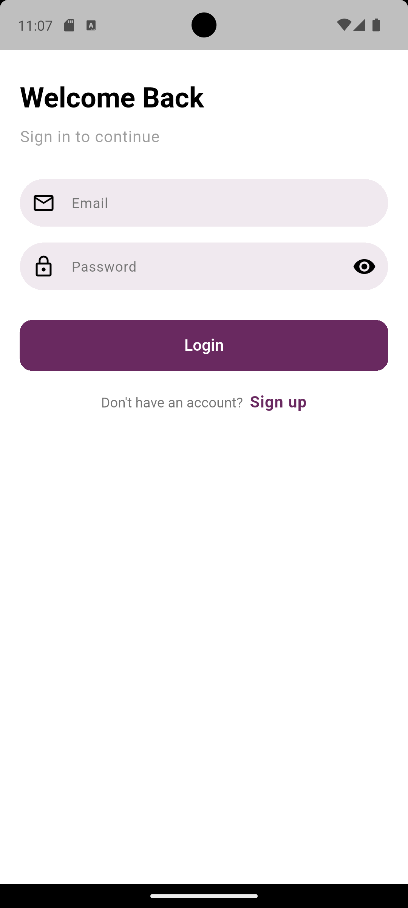
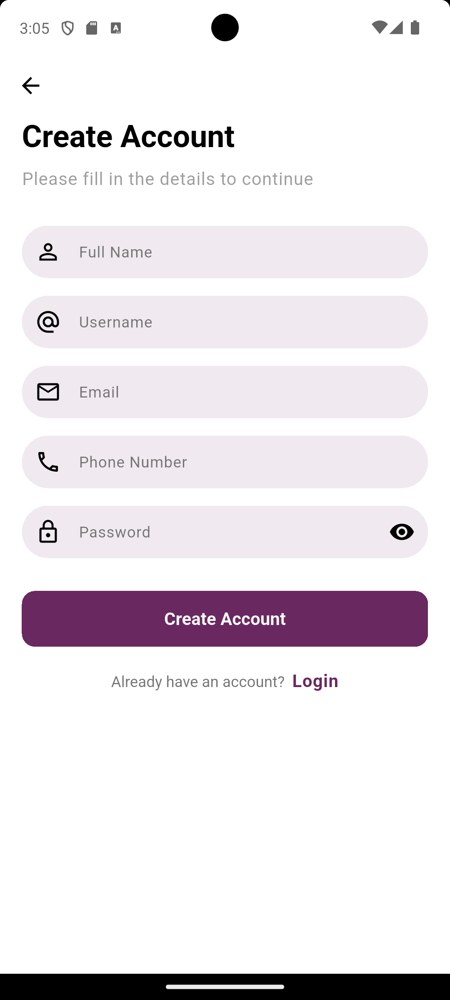
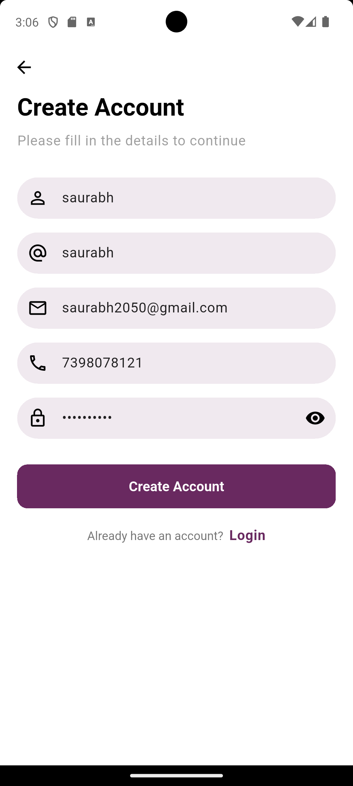
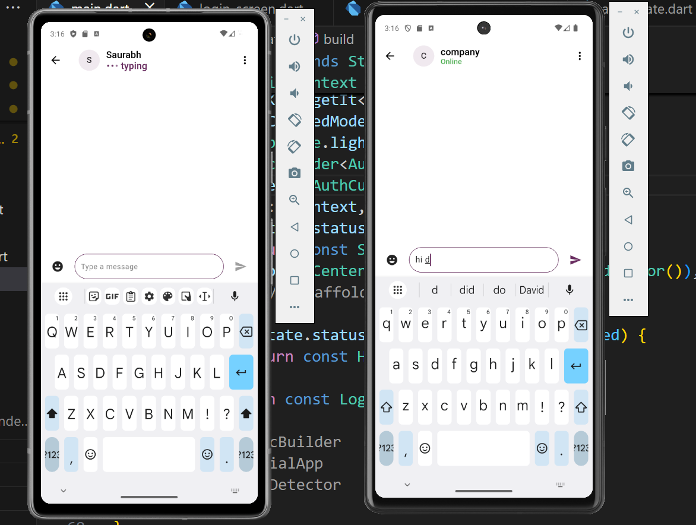
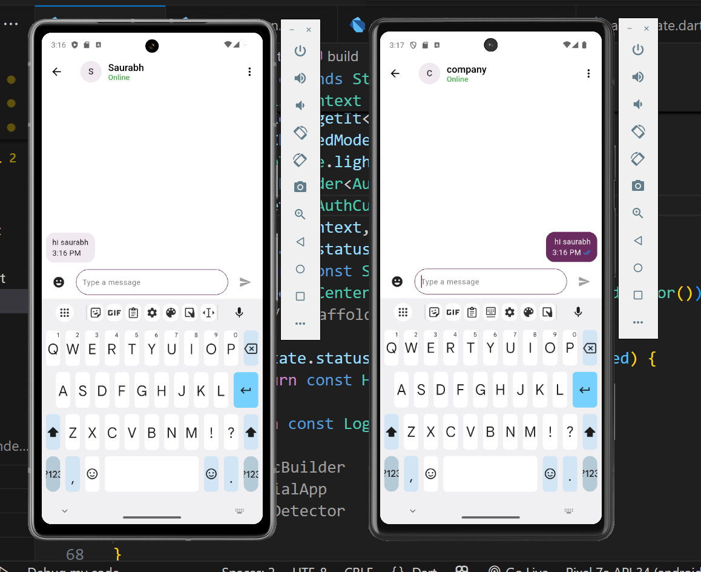
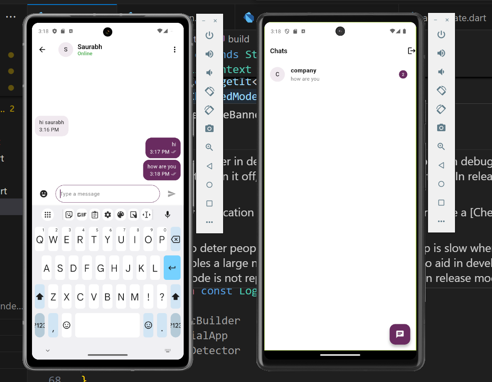
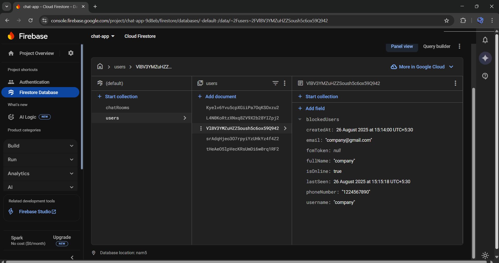
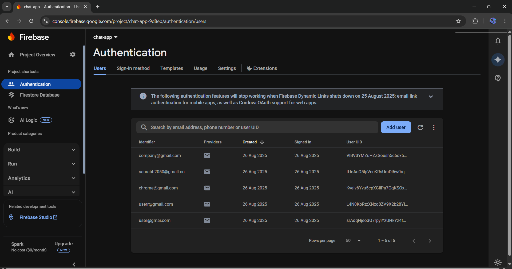
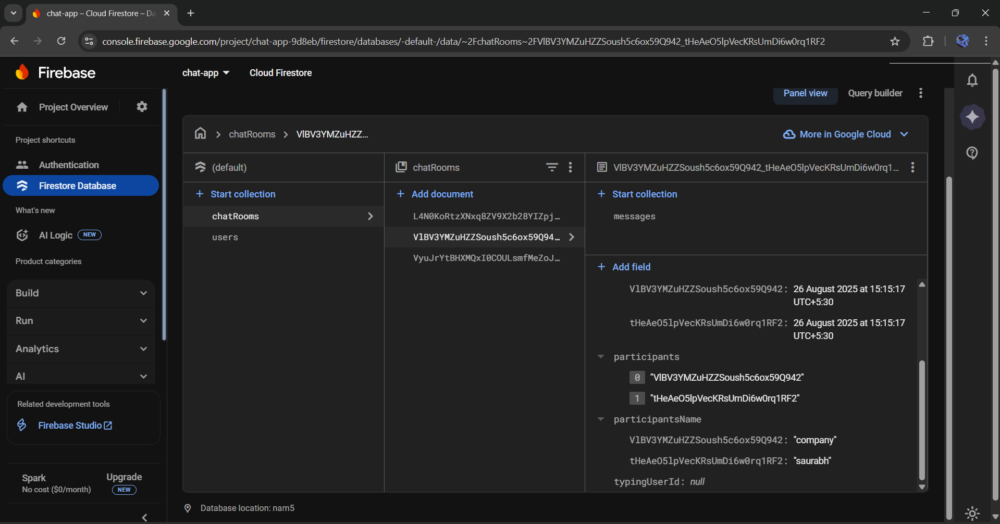

# 🚀 FlareChat – Chat App in Flutter

**FlareChat** — a scalable 1-to-1 real-time chat app built with **Flutter** and **Firebase**.  
Designed for seamless communication with online/offline presence, message ticks, and real-time updates.

---

## ✨ Features

- 🔐 **Firebase Authentication** (email/password)
- ⚡ **Real-time Messaging** using Firestore
- 🟢 **Online / Last Seen** presence (green dot / timestamp)
- ✅ **Message Ticks**  
  - Single tick = sent  
  - Double tick = delivered  
- 😀 **Emoji Support**
- ⬇️ **Auto-scroll** to latest message
- 🔔 **Unread message count**
- 🛡 **Input validation & error handling**

---

## 🛠 Tech Stack

- **Framework**: Flutter (Dart)  
- **Backend**: Firebase (Authentication, Firestore, Realtime Database for presence)  
- **State Management**: Cubit (BLoC package)  

---

## 📸 Screenshots

<table>
  <tr>
    <td></td>
    <td></td>
    <td></td>
  </tr>
  <tr>
    <td></td>
    <td></td>
 
<!--     <td></td> -->
  </tr>
  <tr>
    <td></td>
    <td></td>

  </tr>
  <tr>
    <td></td>
    <td></td>
    
  </tr>
</table>
 
## 📦 Repo Structure
 ```
lib/
│ firebase_options.dart
│ main.dart
│
├── config/
│ └── theme/
│ └── app_theme.dart
│
├── core/
│ ├── common/
│ │ ├── custom_button.dart
│ │ └── custom_text_field.dart
│ │
│ └── utils/
│ └── ui_utils.dart
│
├── data/
│ ├── models/
│ │ ├── chat_message.dart
│ │ ├── chat_room_model.dart
│ │ └── user_model.dart
│ │
│ ├── repositories/
│ │ ├── auth_repository.dart
│ │ ├── chat_repository.dart
│ │ └── contact_repository.dart
│ │
│ └── services/
│ ├── base_repository.dart
│ └── service_locator.dart
│
├── logic/
│ ├── cubits/
│ │ ├── auth/
│ │ │ ├── auth_cubit.dart
│ │ │ └── auth_state.dart
│ │ │
│ │ └── chat/
│ │ ├── chat_cubit.dart
│ │ └── chat_state.dart
│ │
│ └── observer/
│ └── app_life_cycle_observer.dart
│
├── presentation/
│ ├── chat/
│ │ └── chat_message_screen.dart
│ │
│ ├── home/
│ │ └── home_screen.dart
│ │
│ ├── screens/
│ │ └── auth/
│ │ ├── login_screen.dart
│ │ └── signup_screen.dart
│ │
│ └── widgets/
│ ├── chat_list_tile.dart
│ └── loading_dots.dart
│
└── router/
└── app_router.dart
pubspec.yaml
README.md
```

---

## 🚀 Getting Started

### Prerequisites

- Flutter SDK installed
- Firebase project created
- Android Studio / Xcode (for emulators)

### Setup

1. Clone the repo:
   ```bash
   git clone https://github.com/Saurabhmaurya111/FluttFireChat.git
   cd FlutterFireChat
2. Install dependencies:
   ```bash
   flutter pub get 
4. Firebase setup:

Enable Authentication → Email/Password.

Create Firestore database.

Use Realtime Database or Firestore field for presence tracking.

5. Download and add:

android/app/google-services.json

ios/Runner/GoogleService-Info.plist
